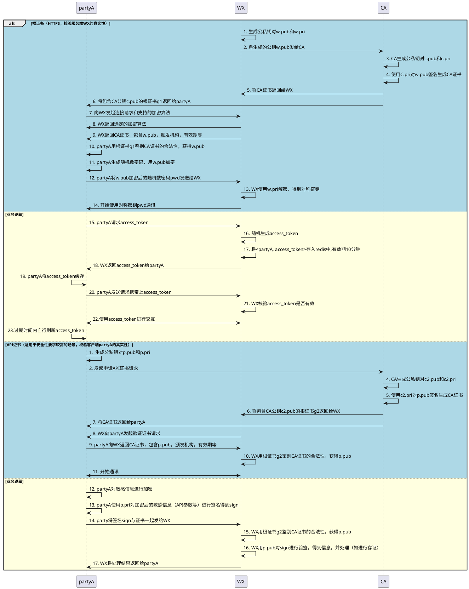

```plantuml
@startuml
participant partyA
participant WX
alt #LightBlue 根证书（HTTPS，校验服务端WX的真实性）
WX -> WX : 1. 生成公私钥对w.pub和w.pri
WX -> CA : 2. 将生成的公钥w.pub发给CA
CA -> CA : 3. CA生成公私钥对c.pub和c.pri
CA -> CA : 4. 使用C.pri对w.pub签名生成CA证书
CA -> WX : 5. 将CA证书返回给WX
partyA <- CA : 6. 将包含CA公钥c.pub的根证书g1返回给partyA
partyA -> WX : 7. 向WX发起连接请求和支持的加密算法
partyA <- WX : 8. WX返回选定的加密算法
partyA <- WX : 9. WX返回CA证书，包含w.pub，颁发机构，有效期等
partyA -> partyA : 10. partyA用根证书g1鉴别CA证书的合法性，获得w.pub
partyA -> partyA : 11. partyA生成随机数密码，用w.pub加密
partyA -> WX : 12. partyA将w.pub加密后的随机数密码pwd发送给WX
WX -> WX : 13. WX使用w.pri解密，得到对称密钥
partyA <- WX : 14. 开始使用对称密钥pwd通讯
else #LightYELLOW 业务逻辑 
partyA -> WX : 15. partyA请求access_token
WX -> WX : 16. 随机生成access_token
WX -> WX : 17. 将<partyA, access_token>存入redis中,有效期10分钟
partyA <- WX : 18. WX返回access_token给partyA
partyA <- partyA : 19. partyA将access_token缓存
partyA -> WX : 20. partyA发送请求携带上access_token
WX -> WX : 21. WX校验access_token是否有效
partyA <-> WX : 22.使用access_token进行交互
partyA <- partyA : 23.过期时间内自行刷新access_token

else #LightBlue API证书（适用于安全性要求较高的场景，校验客户端partyA的真实性）
partyA -> partyA : 1.  生成公私钥对p.pub和p.pri
partyA -> CA : 2. 发起申请API证书请求
CA -> CA : 4. CA生成公私钥对c2.pub和c2.pri
CA -> CA : 5. 使用c2.pri对p.pub签名生成CA证书
CA -> WX : 6. 将包含CA公钥c2.pub的根证书g2返回给WX
partyA <- CA : 7. 将CA证书返回给partyA
partyA <- WX : 8. WX向partyA发起验证证书请求
partyA -> WX : 9. partyA向WX返回CA证书，包含p.pub，颁发机构，有效期等
WX -> WX : 10. WX用根证书g2鉴别CA证书的合法性，获得p.pub
partyA <-> WX : 11. 开始通讯
else #LightYELLOW 业务逻辑
partyA -> partyA : 12. partyA对敏感信息进行加密
partyA -> partyA : 13. partyA使用p.pri对加密后的敏感信息（API参数等）进行签名得到sign
partyA -> WX : 14. party将签名sign与证书一起发给WX
WX -> WX : 15. WX用根证书g2鉴别CA证书的合法性，获得p.pub
WX -> WX : 16. WX用p.pub对sign进行验签，得到信息，并处理（如进行存证）
partyA <- WX : 17. WX将处理结果返回给partyA
end
@enduml
```